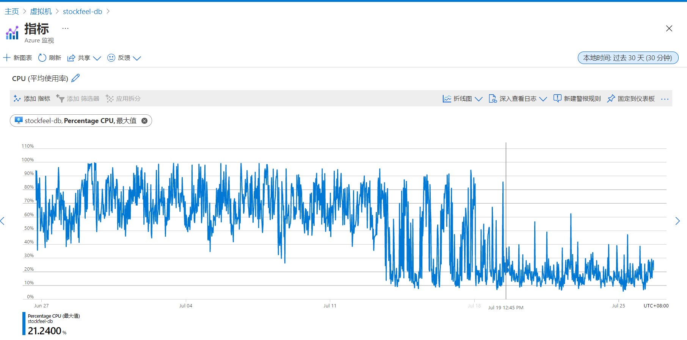
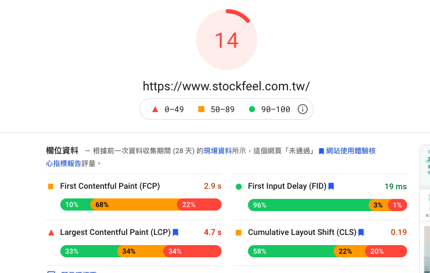
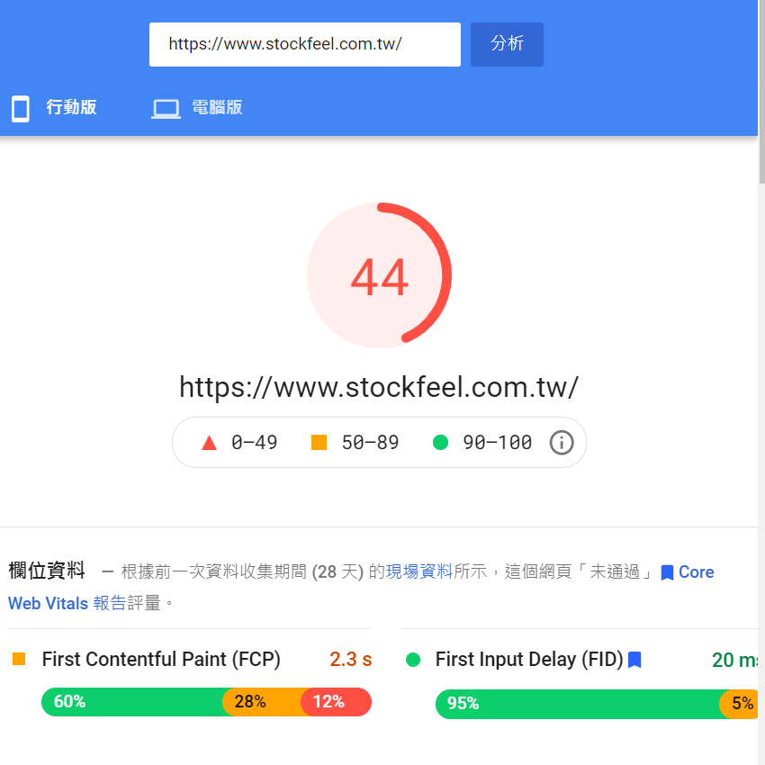
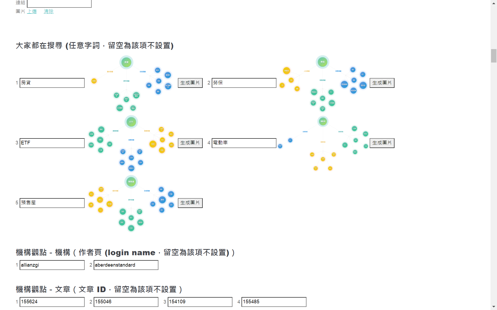

# 股感二年回顧

### 整體成果

* 完成會員系統、廣告系統

* 擋下 Cloudflare WAF 漏掉的攻擊

* 首頁、文章頁、區域市場、目標基金及會員頁等多個頁面製作，含前端切版串接、後端 API 及資料排程

    * 首頁 Mobile Pagespeed 分數由 20 以下改善到最高可達 44 分

    * 製作文章地圖、會員收藏/追蹤按鈕等多個元件，以及底層共用 utils

    * 自製圖檔壓縮、自動截圖、連線頻率限制等多項工具

* Azure 費用降低 42%

    * 主站負載 (Request 數, 資料傳輸量) 降低約 60%

    * 圖檔總量由 24GB 減少為 14GB

    * 移除數十項 Azure 閒置資源

    * 主站資料庫負載 (CPU 百分比) 由 70% ~ 90% 降為 10% ~ 30%

    > 

### 效能改善

* 主站加上記憶體內快取, 避免重覆作業

* 調整 Cloudflare 快取, 降低機器負載及 Bandwidth 花費

* 排查效能問題

    * 與其他同事確認各機器排程及專案狀況

    * 比對各機器 Monitor 記錄

    * 觀察 Cloudflare 記錄確認各 Request Path 狀況

    * 程式中加記錄, 找出大量 Request 原因

* 改善太耗資源的 MySQL 及 MongoDB 查詢

    * 避免過大資料量的 Join

    * 使用效率較好的比對方式, 如對全文用 Regex 比對開頭字串改為先用 subquery 取開頭再比對

    * Mongo 避免拉不必要的欄位, 並先用 aggregate 過濾減少資料傳輸與後續處理的量

* 調整機器上排程的 priority, 避免卡線上服務

* 修正上傳檔案到 Azure 的外掛取得上傳 progress 的 Bug 造成大量 request

### 資安問題處理

##### 公司網站或系統

* 主站實作 Rate Limiting 擋大量惡意攻擊

> Azure App Service 不方便安裝設定 Apache Module

> Cloudflare WAF (Web Application Firewall) 僅能識別並擋下約 10%

> Cloudflare Rate Limiting 費用太高 (NTD 1.5 / 10000 requests)

* 調整 Cloudflare 防火牆規則

    * block 特定 IP 及自訂應阻擋 Cookie

    * 外部登入後台加 Cloudflare Captcha Challenge

##### 外部專案

* 外部專案某人壽官網 - 協助處理弱掃問題，包含 XSS, Path Traversal, SQL Injection, JAVA Heap Dump 等

* 外部專案某金控 - AES 加密

### 系統維運與流程改善

* 主站 Docker 化研究

    * 確認相依套件及環境設定, 撰寫 Dockerfile 及 shell

    * 為後續主站上 Azure App Service 準備

* 解決 Let's Encrypt 自動更新失效

    * 升級 certbot 及 python3-acme

* 測試環境架設 Jenkins

    * 自動切分支拉資料庫建置測試站

    * 串接清 Cloudflare 快取 API

* 排程備份主站資料庫

    * 撰寫備份 Shell

    * Azure VM 加掛資料碟存放備份

##### Azure 服務管理

* 清理資源及調整機器

    * 移除數十項閒置的資源，包含磁碟、公共 IP、儲存體內容、備份項目、App Service 及 SQL Server

    * 依 VM 資源使用狀況，調整為適當的大小

    * 啟用圖檔儲存體時間追蹤功能，不存取的項目移到 cool storage 節省花費

* 解決 [DST Root CA X3 Expiration (September 2021)](https://letsencrypt.org/zh-tw/docs/dst-root-ca-x3-expiration-september-2021/) 造成的問題

    * 主要問題：使用的 Azure App Service Plan 無法自行設定信賴的憑證

    * 處理方式：內部 API 忽略 SSL 檢查

* 主站 PHP App Service 安裝 APCu

    * 快取加速

    * 記錄資訊供問題排查

    * 實現 Rate Limiting

### 程式開發

##### 各種小工具

* 業務官網 LOGO 圖檔處理 - 使用 JAVA

* 自動爬網站找 JS Error - 使用 JAVA, Selenium

* 搜尋圖譜截圖並上傳 Azure - 使用 NodeJS, Selenium, Azure SDK

* 截取頁面中實際使用到的 CSS Rules - 使用 JavaScript

* Azure 儲存體圖檔自動壓縮重傳 - 使用 NodeJS, PNGJS, 圖檔壓縮套件, Azure SDK

##### 編輯系統 (NodeJS/Vue 3)

* 使用 GraphQL 整合 API, Redlock 做分散式鎖, WebSocket Server Push

* 使用 Swagger Generator 自動生成 API Swagger 文件

* 使用 Mocha/Supertest 做 API 自動測試及單元測試

* 使用 Selenium 做 hedless 瀏覽器自動測試

##### 主站 (PHP/jQuery/Webpack/Vue2.6)

* [新版首頁](https://www.stockfeel.com.tw/)

    * 互動, 會員功能及資料串接

    * page speed 優化

    > 2021-09 測試, 由 20 以下優化到最高可達 44 分 (YouTube 行動版約 33 分)

    > 優化前

    > 

    > 優化後

    > 

* 簡易新版首頁後台

> 

* [新版文章頁](https://www.stockfeel.com.tw/%e5%a6%82%e4%bd%95%e7%9c%8b%e6%87%82%e4%b8%8a%e5%b8%82%e5%85%ac%e5%8f%b8%e8%b2%a1%e5%a0%b1%e7%b3%bb%e5%88%97%ef%bc%9a%e6%90%8d%e7%9b%8a%e8%a1%a8/?utm_source=map_recommend&from_post_id=57657)

    * 頁面切版及互動

    * 下方關聯地圖元件製作及串接

* [區域市場頁面](https://www.stockfeel.com.tw/regional/)

    * 資料串接

    * 地圖區塊切版及動態

* [主題投組頁面](https://www.stockfeel.com.tw/screener/?slug=portfolio-ingredients-tw)

    * 後端 API

    * 頁面切版串接

    * 打第三方 API 取資料及各項數值計算的排程

* [目標基金頁面](https://www.stockfeel.com.tw/targetfund/)

    * 後端 API

    * 前端串接及互動

* [會員功能](https://www.stockfeel.com.tw/member/account)

    * 會員頁面製作

    * 追踪按鈕及收藏按鈕元件製作

* 使用者行為記錄與分析

    * 訂定資料格式

    * 開發後端 API 及前端 JS Utils

    * 與資料科學家協作

    > 確認分析邏輯

    > 改善 SQL/Mongo 查詢效能

    > 探討機器配置及排程設定

    > 規劃快取方式

* 廣告系統

    * 資料規格製訂

    * 前端各版位切版及串接

    * 事件記錄 (派送、畫面顯示、點擊)

